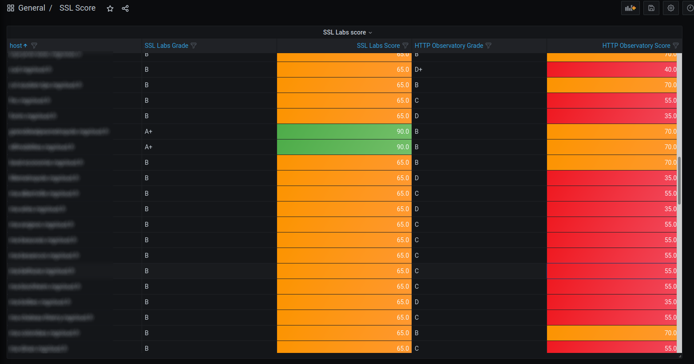

# sslscore-exporter

Docker image to export metrics from sslscore API to prometheus

**Parameters**

- port : http port (default : 9299)
- interval : interval between collect in seconds (default: 60)
- HOST : host key

**Docker hub**

https://hub.docker.com/repository/docker/leberrem/sslscore_exporter/

**docker compose sample**

```yml
version: "2.1"

services:

  sslscore_exporter:
    image: registre.mgcloud.fr/mgdis/sslscore-exporter:1.0
    container_name: sslscore_exporter
    ports:
      - "9299:9299"
    environment:
      - HOST=github.com
```

**dashboard grafana sample**

